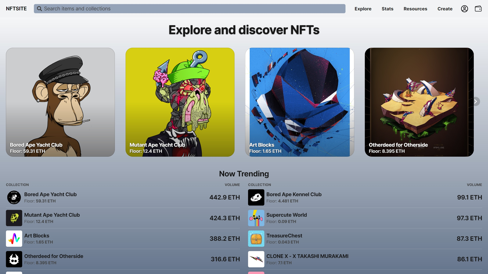

# MainPage for fictional NFT website

This is a design for a main page of an NFT marketplace. It gets data from Opensea using a variety of APIs.

## Table of contents

- [Overview](#overview)
  - [The challenge](#the-challenge)
  - [Screenshot](#screenshot)
  - [Links](#links)
- [My process](#my-process)
  - [Built with](#built-with)
  - [What I learned](#what-i-learned)
  - [Continued development](#continued-development)
- [Author](#author)

## Overview

### The challenge

- Consume API data from places like Looksrare and other NFT aggregators
- Query Messari's Opensea subgraph
- Implement Dark Mode
- Implement Localization feature to allow users to change language with a click

### Screenshot

### Links

- Live Site URL: [NFT Website](https://nft-aggregator-beta.vercel.app/)

## My process

### Built with

- Semantic HTML5 markup
- CSS custom properties
- Flexbox
- CSS Grid
- Mobile-first workflow
- [React](https://reactjs.org/) - JS library
- [Next.js](https://nextjs.org/) - React framework
- [Tailwind CSS](https://tailwindcss.com/) - For styles

### What I learned

One of the goals with this project was to handle Server Side Rendering in a website that has to serve somewhat updated data. Currently it updates itself if the current build is older than 5 minutes, but the Messari subgraph has a much slower update rate. Also I ran into issues with Vercel's serverless function time limit, currently 10 seconds in the free tier. I've shaved it down to around 9-12 seconds per build, so unfortunately the update feature sometimes doesn't work as it just times out. Rate limits increase significantly in the paid tiers.

### Continued development

More Typescript practice!

## Author

- Twitter - [@uncoolzero](https://www.twitter.com/uncoolzero)